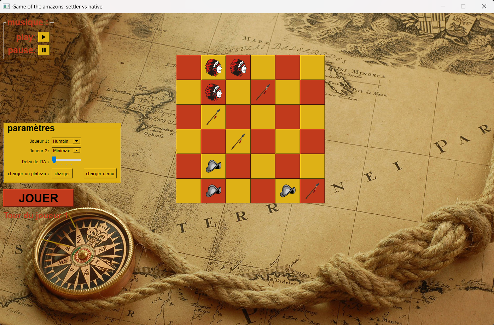

# 🎯 Amazons Board Game 

<p align="center">
  
  
</p>

This project was developed at **Université libre de Bruxelles (ULB)** as part of the **INFO-F106** course.  
It is a Python implementation of a **strategic board game** inspired by *The Game of the Amazons*, featuring a graphical interface, sound effects, and an **AI opponent powered by the Minimax algorithm**.

---

## 🧠 Project Overview

The objective of this project was to design a playable and interactive board game using **object-oriented programming** and **algorithmic logic**.  
Players can move their pieces across a grid-based board, block opponents, and plan their moves strategically.  
An **AI agent** was implemented using the **Minimax algorithm**, allowing human vs. computer gameplay with real-time decision-making.

---

## 🤖 Artificial Intelligence (AI)

The game includes an **AI opponent** based on the **Minimax algorithm**, a classic decision-making strategy in game theory.  
- The AI simulates possible future moves and selects the one that maximizes its advantage while minimizing the player's potential gain.  
- The evaluation function considers board control and movement possibilities.  
- This approach ensures that the AI behaves strategically, making it a challenging opponent for human players.

---

## ⚙️ Technologies Used

- **Language:** Python 3  
- **Libraries:**  
  - `pygame` – for the graphical interface and sound  
  - `math` – for geometric and positional calculations  
  - Custom modules: `action.py`, `board.py`, `players.py`, `matrix.py`, `const.py`, etc.  
- **IDE / Tools:** Visual Studio Code, or any Python IDE  
- **Assets:** `.png` images and `.wav` sounds for visual and audio feedback

---

## 🕹️ Features

- Graphical interface with sounds and animations  
- Playable against another player **or against the AI (Minimax)**  
- Multiple board configurations (`plateau_1.txt` → `plateau_4.txt`)  
- Modular code design for easy extension and debugging  
- Interactive main menu and pause system  
- Turn-based gameplay with move validation

---

## 🚀 Usage

1. Clone the repository:
  ```bash
  git clone https://github.com/rtektas/Amazone-game-ULB.git
  ```

3. Install dependencies (if needed):
  ```bash
  pip install pygame
  ```

3. Run the game:
  ```bash
  python partie4.py
  ```

4. Select your mode:

- Player vs Player
- Player vs AI (Minimax)
- AI vs AI

## 🎲 Game Rules (How to Play)

### 🧩 Overview
This project implements the **Game of the Amazons**.  
Two players (Player 1 and Player 2) alternate moves.  
Each move has three parts:
1. Move one of the player's queens (amazons)
2. Fire an arrow from that queen to a free square
3. The arrow permanently blocks that square

The board is an **N×N grid**:
- Columns are labeled with letters (a, b, c, ...)
- Rows with numbers (1..N)
- Positions are written as a letter followed by a number (for example: `a1`, `b6`)

---

### ♟️ Turn / Legal Move
A queen moves like a **chess queen**:
- Any number of squares in a straight line (horizontal, vertical, or diagonal)
- Cannot jump over occupied squares (queens or arrows)

After moving a queen, the player must **shoot an arrow** from the queen’s new location:
- The arrow travels like a queen to any empty reachable square
- The arrow permanently blocks that square
- You cannot shoot an arrow to the same square as the queen’s destination
- You cannot shoot onto non-empty squares

---

### 🏆 Winning / End of Game
The game ends when one of two conditions is met:

#### 1. Region Scoring
- When the number of arrows on the board is at least equal to the board size  
- The program divides the board into connected components (rectangles, lines, triangles, etc.)  
- Each component that contains exactly one queen gives its owner **points = component_size - 1**  
- The player with the higher total score wins

#### 2. Mobility
- If one player has **no legal moves** while the other still does, the player who can still move wins  
- If **both players have no moves**, the code reports a tie `(0, 0)` by default — this can be changed to declare a draw

At the end of the game, the **GUI displays the winner and final scores**.


