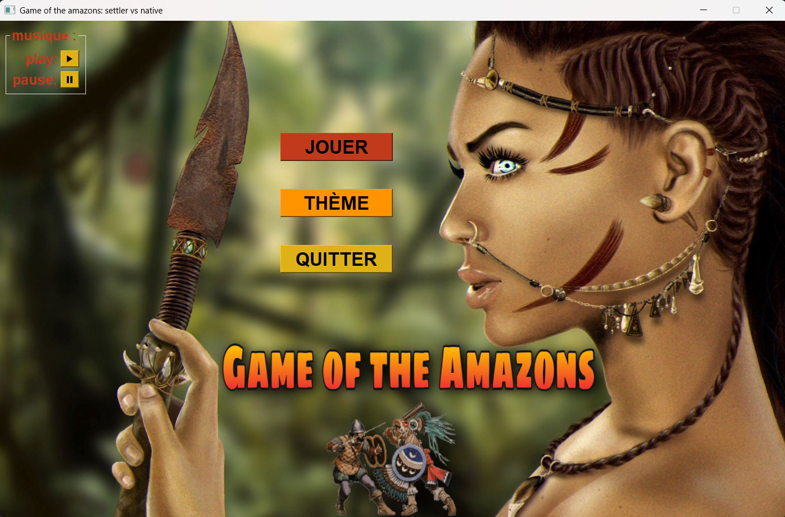

# Amazons Board Game 🎯

<p align="center">
  
</p>

This project was developed at **Université libre de Bruxelles (ULB)** as part of the **INFO-F106** course.  
It is a Python implementation of a **strategic board game** inspired by *The Game of the Amazons*, featuring a graphical interface, sound effects, and an **AI opponent powered by the Minimax algorithm**.

---

## 🧠 Project Overview

The objective of this project was to design a playable and interactive board game using **object-oriented programming** and **algorithmic logic**.  
Players can move their pieces across a grid-based board, block opponents, and plan their moves strategically.  
An **AI agent** was implemented using the **Minimax algorithm**, allowing human vs. computer gameplay with real-time decision-making.

---

## 🤖 Artificial Intelligence (AI)

The game includes an **AI opponent** based on the **Minimax algorithm**, a classic decision-making strategy in game theory.  
- The AI simulates possible future moves and selects the one that maximizes its advantage while minimizing the player's potential gain.  
- The evaluation function considers board control and movement possibilities.  
- This approach ensures that the AI behaves strategically, making it a challenging opponent for human players.

---

## ⚙️ Technologies Used

- **Language:** Python 3  
- **Libraries:**  
  - `pygame` – for the graphical interface and sound  
  - `math` – for geometric and positional calculations  
  - Custom modules: `action.py`, `board.py`, `players.py`, `matrix.py`, `const.py`, etc.  
- **IDE / Tools:** Visual Studio Code, or any Python IDE  
- **Assets:** `.png` images and `.wav` sounds for visual and audio feedback

---

## 🕹️ Features

- Graphical interface with sounds and animations  
- Playable against another player **or against the AI (Minimax)**  
- Multiple board configurations (`plateau_1.txt` → `plateau_4.txt`)  
- Modular code design for easy extension and debugging  
- Interactive main menu and pause system  
- Turn-based gameplay with move validation

---

## 🚀 Usage

1. Clone the repository:
   ```bash
   git clone https://github.com/your-username/amazons-game.git
   cd amazons-game
